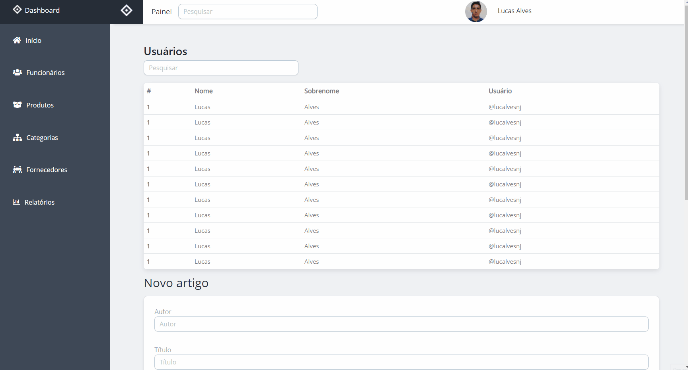

<h1 align="center">Admin Dashboard</h1>

<p align="center">A simple dashboard using Bootstrap and Javascript features.</p>

## Screenshots



## Technologies used

- [Bootstrap](https://getbootstrap.com/)
- [JQuery](https://jquery.com/)
- [Chart.js](https://www.chartjs.org/)

## Install

```bash
# Clone this repository
$ git clone git@github.com:lucalves/admin-dashboard.git

# Go into the repository
$ cd admin-dashboard

# Open the repository in the IDE (If you use VS Code)
$ code .

# Just open the index.html file!
```
